<div align="center">


<h1>DevOps Platform</h1>

<p><strong>The Institutional-Grade Platform for Standardized Delivery Foundations, IDP Orchestration Governance, and Multi-Cloud Self-Service Ecosystems.</strong></p>

[]()
[]()
[]()

<br/>

> **"Industrializing self-service delivery to automate platform foundations."** 
> **DevOps Platform** is an enterprise-grade solution designed to provide a secure, measurable, and highly automated foundation for global Internal Developer Platforms (IDPs). It orchestrates the complex lifecycle of platform engineering—from developer portal requests and Golden Path scaffolding to GitOps deployment and unified operational auditing.

</div>

---

## 🏛️ Executive Summary

Fragmented tooling silos and manual infrastructure ticketing are strategic operational liabilities; lack of centralized platform orchestration is a primary barrier to organizational cloud maturity and developer velocity. Organizations fail to maintain a secure engineering foundation not because of a lack of technology, but because of fragmented delivery standards, lack of automated provisioning validation, and an inability to orchestrate self-service planes with operational precision.

This repository provides the **Platform Intelligence Plane**. It implements a complete **DevOps-Platform-as-Code Framework**, enabling Platform and SRE teams to manage global developer portals as first-class citizens. By automating the identification of delivery bottlenecks through real-time workflow analysis and orchestrating the provisioning of secure performance-driven infrastructure policies, we ensure that every organizational team—from frontend squads to data engineering groups—is empowered by default, audited for history, and strictly aligned with institutional Golden Path frameworks.

---

## 📐 Architecture Storytelling: Principal Reference Models

### 1. Principal Architecture: Global DevOps Platform & Platform Intelligence Plane
This diagram illustrates the end-to-end flow from IDP portal requests and multi-cloud orchestration to infrastructure enforcement, performance validation, and institutional maturity auditing.

```mermaid
graph LR
    %% Subgraph Definitions
    subgraph PlatformIngress["IDP & Service Ingress"]
        direction TB
        Dev_Portal["Developer Portal / Backstage"]
        Service_Catalog["Golden Paths / App Templates"]
        Security_Guardrails["OIDC Identity / Cost Controls"]
    end

    subgraph IntelligenceEngine["Platform Intelligence Hub"]
        direction TB
        API["FastAPI Platform Gateway"]
        ProvisioningOrchestrator["Global Delivery & Catalog Hub"]
        Governance_Hub["Compliance & Standard Guardrail Hub"]
        AIOps_Validator["Drift & Velocity Analysis Hub"]
    end

    subgraph OperationsPlane["Distributed Delivery Ecosystem"]
        direction TB
        ManagedWorkloads["Managed Standardized Cloud Workloads"]
        ActivePipelines["Managed Automated GitOps Pipelines"]
        ResourceSinks["Managed Infrastructure Delivery Hubs"]
    end

    subgraph OperationsHub["Institutional Platform Hub"]
        direction TB
        Scorecard["Platform Maturity Scorecard"]
        Analytics["Adoption Flow & Readiness Velocity Stats"]
        Audit["Forensic Platform Metadata Lake"]
    end

    subgraph DevOps["DevOps-Platform-as-Code Framework"]
        direction TB
        TF["Terraform IDP Modules"]
        DriftBot["Platform & Config Drift Validator"]
        ChatOps["Engineering Operations Hub"]
    end

    %% Flow Arrows
    PlatformIngress -->|1. Submit Request| API
    API -->|2. Orchestrate Provisioning| ProvisioningOrchestrator
    ProvisioningOrchestrator -->|3. Apply Platform Guard| Governance_Hub
    Governance_Hub -->|4. Assess Drift| AIOps_Validator
    
    AIOps_Validator -->|5. Execute Delivery| OperationsPlane
    OperationsPlane -->|6. Notify Status| ChatOps
    API -->|7. Visualize Health| Scorecard
    
    Scorecard -->|8. Track Maturity| Analytics
    Scorecard -->|9. Record Provisioning| Audit
    
    TF -->|10. Provision Backbone| IntelligenceEngine
    DriftBot -->|11. Inject Delivery Risk| ProvisioningOrchestrator
    Audit -->|12. Improve Operations| ManagedWorkloads

    %% Styling
    classDef ingress fill:#f5f5f5,stroke:#616161,stroke-width:2px;
    classDef intel fill:#e8eaf6,stroke:#1a237e,stroke-width:2px;
    classDef operations fill:#e1f5fe,stroke:#01579b,stroke-width:2px;
    classDef ops fill:#ede7f6,stroke:#311b92,stroke-width:2px;
    classDef devops fill:#e8f5e9,stroke:#1b5e20,stroke-width:2px;

    class PlatformIngress ingress;
    class IntelligenceEngine intel;
    class OperationsPlane operations;
    class OperationsHub ops;
    class DevOps devops;
```

### 2. The Platform Lifecycle Flow
The continuous path of an internal developer platform from initial request (portal) and provision (IaC) to active configure (GitOps), deliver (pipeline), and institutional forensic auditing.

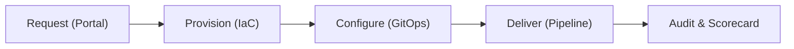

### 3. Distributed Platform Topology
Strategically orchestrating standardized developer environments across global engineering hubs, diverse Kubernetes clusters, and multi-cloud targets, providing a unified institutional view of global platform health.

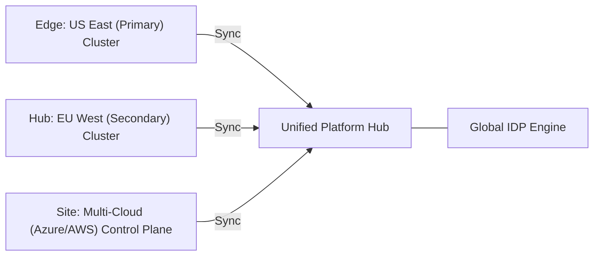

### 4. Self-Service Governance & High-Trust Data Plane Protection Flow
Executing complex logic for securing the bridge between developer portals and infrastructure APIs, ensuring every organizational identity is verified and every provisioning access is according to institutional standards.

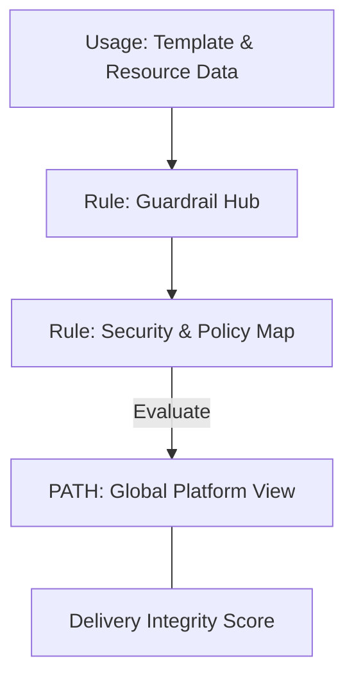

### 5. Multi-Cloud Federation & Platform Governance Flow
Automatically managing unified IDP standards across global regions and diverse cloud accounts, ensuring institutional infrastructure residency and security boundaries by default.

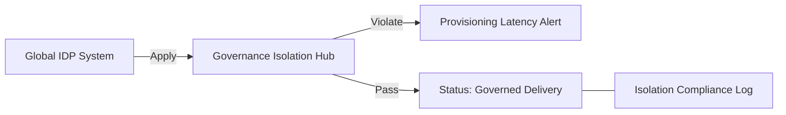

### 6. Encryption & Perimeter Protection Flow (Platform Standard)
Managing the lifecycle of a developer request, automatically enforcing institutional TLS 1.3 and resource encryption standards as required by security policy, ensuring zero-latency security confidence.

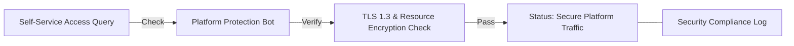

### 7. Institutional Platform Maturity Scorecard
Grading organizational performance based on key indicators: Golden Path Adoption Grade, Self-Service Efficiency Index, and Cognitive Load Reduction.

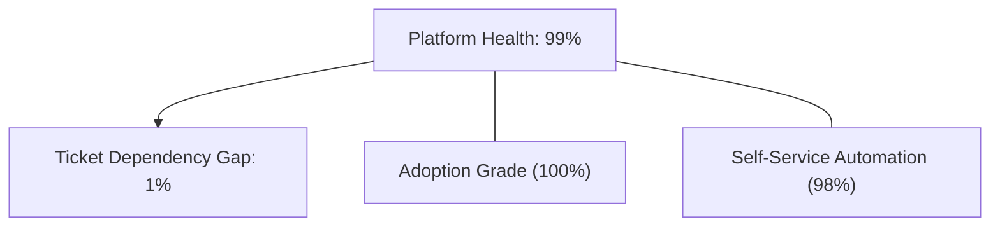

### 8. Identity & RBAC for Platform Governance
Managing fine-grained access to IDP hubs, provisioning workers, and audit logs between Platform Engineers, Developers, and Cloud Architects.

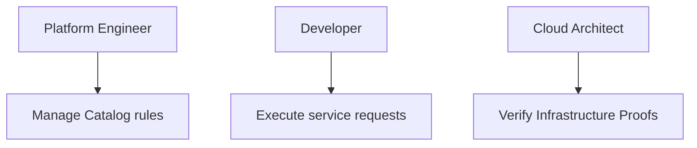

### 9. IaC Deployment: DevOps-Platform-as-Code Framework
Using modular Terraform to deploy and manage the versioned distribution of the platform tracking hubs, policy protection workers, and forensic metadata lakes.

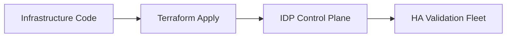

### 10. AIOps Platform Drift & Risk Validation Flow
Using advanced analytics to identify sudden surges in provisioning failures, unauthorized resource scaling, suspicious configuration drifts, or unusual delivery pattern changes that could result in institutional risk or runaway costs.

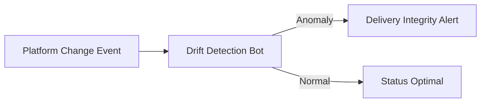

### 11. Metadata Lake for Forensic Platform Audit
Storing long-term records of every self-service event generated (metadata), every delivery pipeline triggered, and every infrastructure provisioning history for institutional record-keeping, compliance auditing, and post-provisioning forensics.

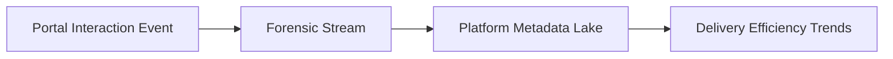

---

## 🏛️ Core Governance Pillars

1.  **Unified Foundation Coordination**: Maximizing velocity by centralizing all self-service workflows through a single institutional plane.
2.  **Automated Environment Provisioning**: Eliminating "manual ticketing" scenarios through proactive orchestration and template verification.
3.  **Sequential Delivery Intelligence**: Ensuring zero-interruption operations through dependency-aware GitOps-driven platform engineering.
4.  **Zero-Trust Guardrail Protection**: Automatically enforcing identity-based access and rule evaluation across all IDP tiers.
5.  **Autonomous Operations Logic**: Guaranteeing reliability through automated industry-specific platform monitoring runbooks.
6.  **Full Platform Auditability**: Immutable recording of every service scaffold and template provision for institutional forensics.

---

## 🛠️ Technical Stack & Implementation

### Platform Engine & APIs
*   **Framework**: Python 3.11+ / FastAPI.
*   **Performance Engine**: Custom Python-based logic for multi-cloud IDP provisioning and DORA-style readiness metrics.
*   **Integrations**: Native connectors for GitHub, ArgoCD, Backstage, and Terraform Enterprise.
*   **Persistence**: PostgreSQL (Platform Ledger) and Redis (Live Delivery State).
*   **Auth Orchestrator**: Federated OIDC/SAML for least-privilege platform management access.

### Governance Dashboard (UI)
*   **Framework**: React 18 / Vite / Backstage Customizations.
*   **Theme**: Dark, Slate, Indigo (Modern high-fidelity platform aesthetic).
*   **Visualization**: D3.js for delivery topologies and Recharts for adoption velocity analytics.

### Infrastructure & DevOps
*   **Runtime**: AWS EKS or Azure Kubernetes Service (AKS) for management plane.
*   **IDP Hub**: Managed event sourcing for immutable platform timeline reconstruction.
*   **IaC**: Modular Terraform for deploying the platform landing zone and validation fleet.

---

## 🏗️ IaC Mapping (Module Structure)

| Module | Purpose | Real Services |
| :--- | :--- | :--- |
| **`infrastructure/idp_hub`** | Central management plane | EKS, PostgreSQL, Redis |
| **`infrastructure/provisioners`** | Distributed automation workers | Azure, AWS, GCP APIs |
| **`infrastructure/portal_pipes`** | Delivery Orchestration Hubs | Webhooks, GitHub Actions |
| **`infrastructure/auditing`** | Forensic platform sinks | S3, Athena, Quicksight |

---

## 🚀 Deployment Guide

### Local Principal Environment
```bash
# Clone the DevOps Platform repository
git clone https://github.com/devopstrio/devops-platform.git
cd devops-platform

# Configure environment
cp .env.example .env

# Launch the Platform stack
make init

# Trigger a mock self-service request and automated guardrail validation simulation
make simulate-platform
```

Access the Developer Portal at `http://localhost:3000`.

---

## 📜 License
Distributed under the MIT License. See `LICENSE` for more information.

---
<div align="center">
  <p>© 2026 Devopstrio. All rights reserved.</p>
</div>
