<div align="center">


<h1>DevOps Platform</h1>

<p><strong>The Enterprise Standard for Industrialized Software Delivery and Self-Service Infrastructure</strong></p>

[]()
[]()
[]()
[]()

<br/>

> **"A platform is a product used by internal customers."** 
> DevOps Platform is a flagship repository designed to enable organizations to standardize, automate, and govern the entire software delivery lifecycle through a self-service internal developer platform.

</div>

---

## 🏛️ Executive Summary

**DevOps Platform** is a flagship repository designed for Chief Technology Officers (CTOs), Platform Engineers, and DevOps Leaders. As organizations scale, the fragmentation of tools and environments becomes the primary bottleneck for engineering velocity.

This platform provides an industrialized approach to **Platform Engineering**, delivering production-ready **Internal Developer Portals**, **Self-Service Infrastructure**, **GitOps Workflows**, and **Standardized CI/CD Blueprints**. It supports **Azure**, **AWS**, **GCP**, and **Kubernetes**, enabling teams to transition from "Manual Operations" to "Standardized Platform Services."

---

## 💡 Why DevOps Platforms Matter

Internal Developer Platforms (IDPs) are the foundation of modern engineering:
- **Cognitive Load Reduction**: Removing the need for application engineers to manage underlying infrastructure complexity.
- **Velocity**: Enabling "Day-0" productivity through automated golden path templates and environment provisioning.
- **Security & Compliance**: Embedding guardrails directly into the self-service workflows (Guardrails-as-a-Service).
- **Consistency**: Ensuring every service follows organizational standards for observability, reliability, and security.

---

## 🚀 Business Outcomes

### 🎯 Strategic Operational Impact
- **Industrialized Onboarding**: Reducing the time to provision new services from weeks to minutes.
- **Optimized Cost**: Providing real-time visibility and automated optimization of multi-cloud spend.
- **Reduced Risk**: Enforcing secure SDLC controls and automated compliance evidence collection.
- **Scalable Reliability**: Standardizing SLOs and error budget management across the global fleet.

---

## 🏗️ Technical Stack

| Layer | Technology | Rationale |
|---|---|---|
| **Automation Engine** | Python, GitHub Actions | High-performance orchestration of delivery lifecycles and platform provisioning. |
| **Control Plane** | FastAPI | High-performance API for request management and service orchestration. |
| **Frontend** | React 18, Vite | Premium portal for developer self-service, pipeline visibility, and executive reporting. |
| **IaC Foundation** | Terraform | Multi-cloud infrastructure consistency and platform foundation automation. |
| **Database** | PostgreSQL | Centralized repository for platform metadata, service catalog state, and history. |
| **Observability** | Prometheus / Grafana | Real-time monitoring of platform adoption, delivery metrics, and system health. |

---

## 📐 Architecture Storytelling: 70+ Diagrams

### 1. Executive High-Level Architecture
The holistic vision of the enterprise platform engineering journey.

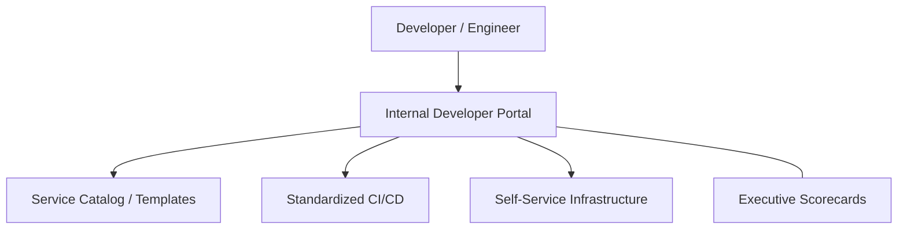

### 2. Detailed Component Topology
The internal service boundaries and management layers of the platform.

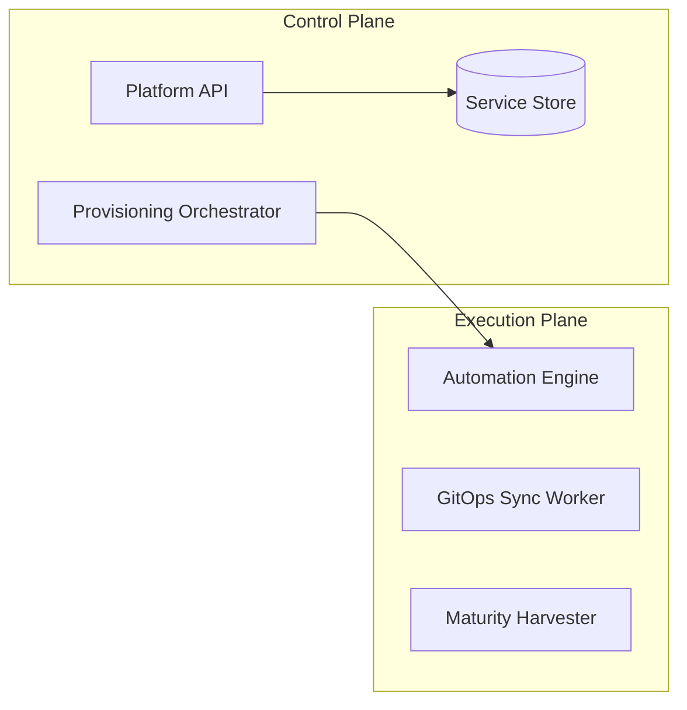

### 3. Developer to Production Request Path
Tracing a "New Service Request" through the industrialized platform stack.

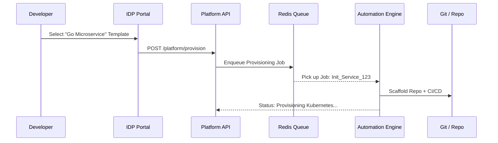

### 4. Platform Control Plane
The "Brain" of the framework managing global service definitions.

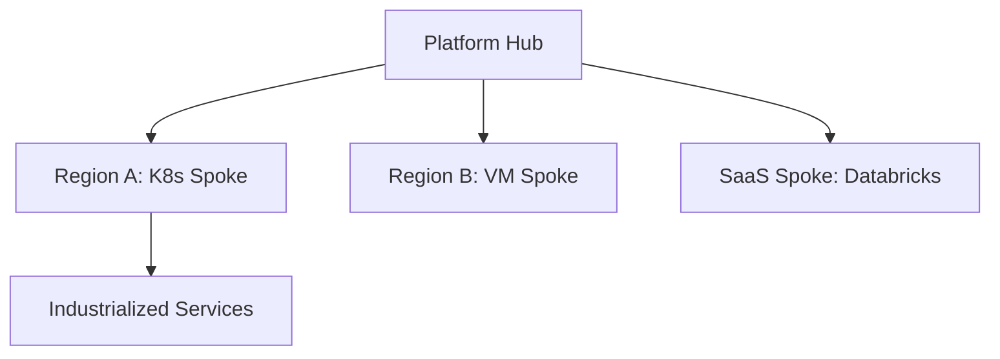

### 5. Multi-Cloud Topology
Synchronizing platform standards across Azure, AWS, and GCP.

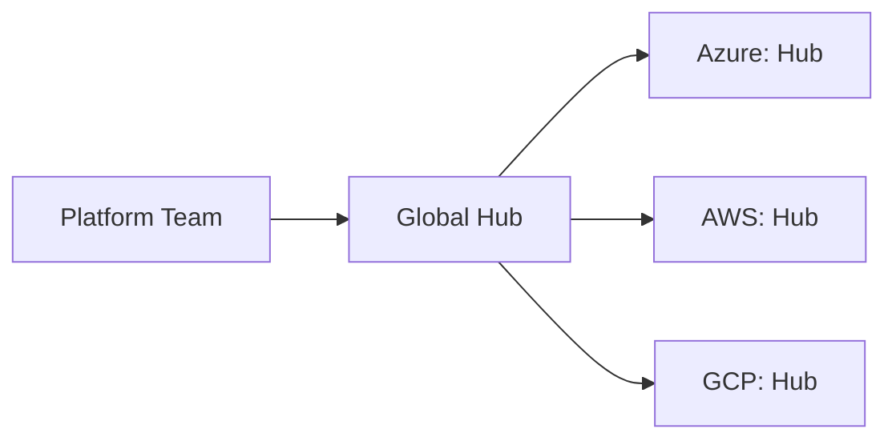

### 6. Regional Deployment Model
Hosting delivery workers close to the target environments for performance.

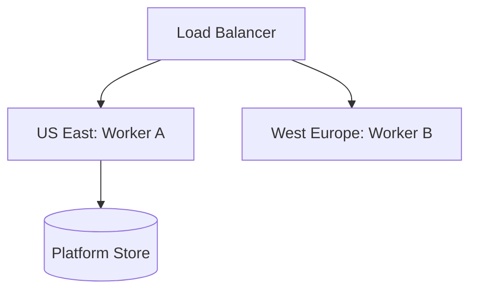

### 7. DR Failover Model
Ensuring platform continuity during regional cloud outages.

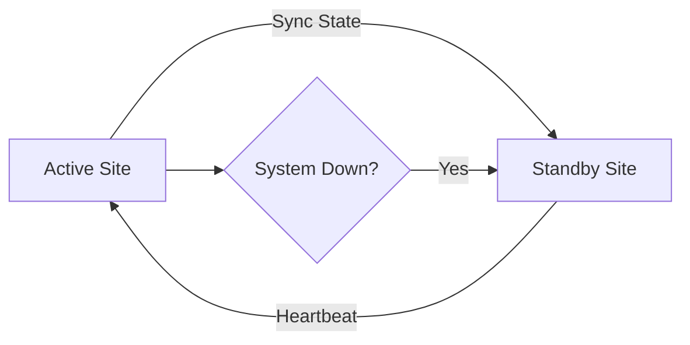

### 8. API Gateway Architecture
Securing and throttling the entry point for platform orchestration.

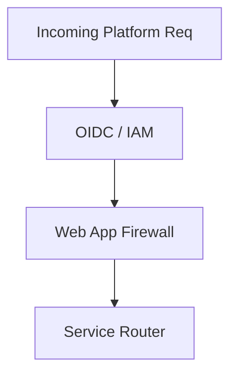

### 9. Queue Worker Architecture
Managing long-running provisioning and sync tasks at scale.

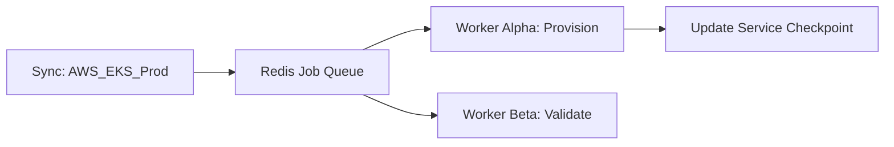

### 10. Dashboard Analytics Flow
How raw delivery telemetry becomes executive platform scorecards.

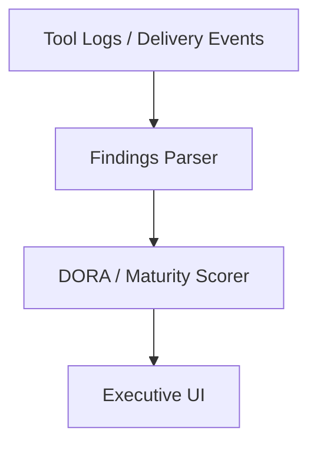

### 11. Developer Portal Workflow
The entry point for all internal developer interactions.

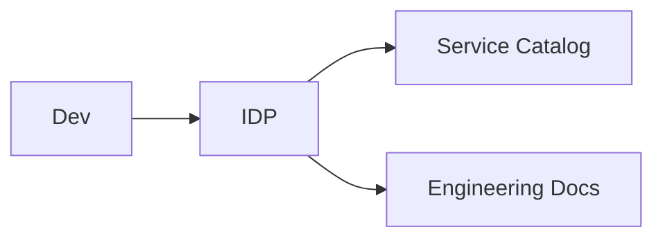

### 12. Golden Path Provisioning Flow
Standardized infrastructure creation via templates.

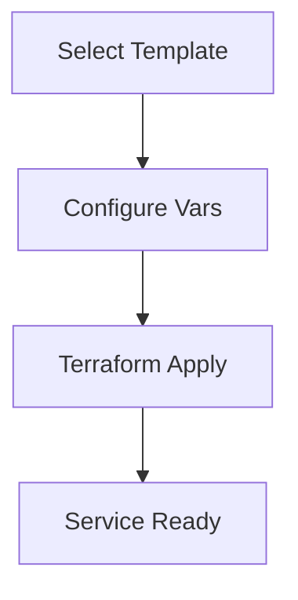

### 13. Template Catalog Model
The repository of approved engineering building blocks.

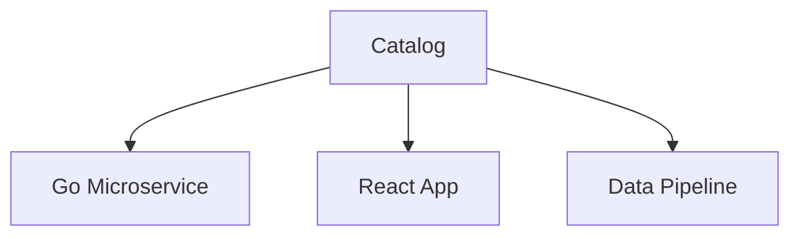

### 14. Backstage Integration Workflow
Extending the platform with specialized plugins.

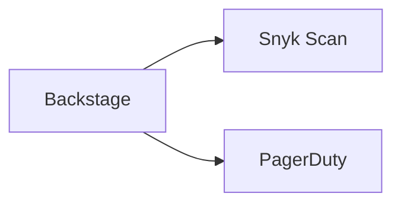

### 15. Service Onboarding Lifecycle
From idea to production-ready service.

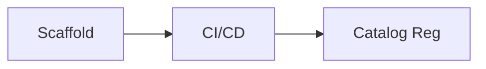

### 16. API Product Catalog Model
Exposing internal APIs for cross-team discovery.

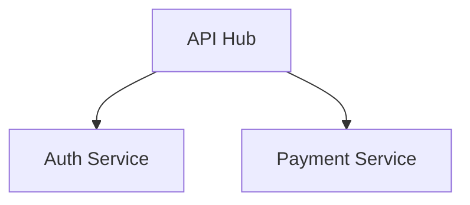

### 17. Environment Request Workflow
Enabling developers to spin up ephemeral or persistent environments.

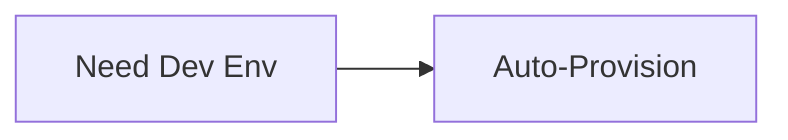

### 18. Namespace Provisioning Model
Isolating teams within shared Kubernetes clusters.

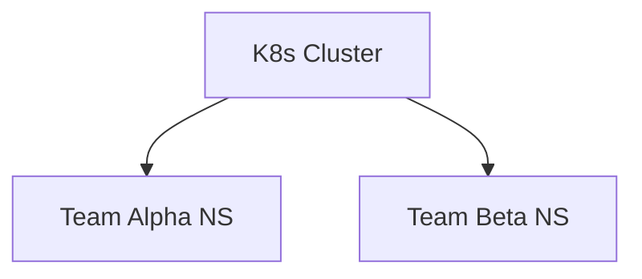

### 19. Shared Services Topology
Common platform utilities available to all tenants.

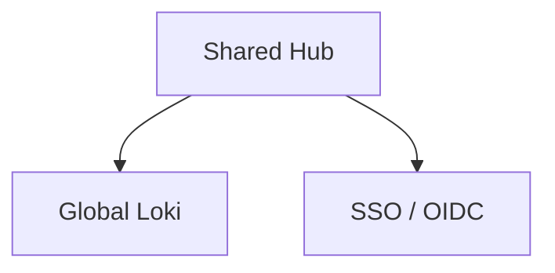

### 20. Tenant Isolation Architecture
Ensuring data and resource separation in a multi-tenant platform.

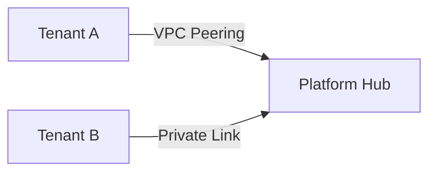

### 21. Commit to Deploy Workflow
The end-to-end delivery journey.

```mermaid
graph LR
    Commit[Commit] --> CI[Build/Test]
    CI --> CD[GitOps Deploy]
```

### 22. PR Validation Pipeline
Governance checks before code merges.

```mermaid
graph TD
    PR[Pull Request] --> Lint[Lint]
    Lint --> Unit[Tests]
    Unit --> Appr[Review]
```

### 23. Artifact Packaging Model
Standardizing binaries and images for distribution.

```mermaid
graph TD
    Code[Code] --> Image[Docker Image]
    Image --> Registry[Global ACR]
```

### 24. Versioning Lifecycle
Automated semantic versioning for platform services.

```mermaid
graph LR
    Tag[Tag] --> SemVer[v1.2.3]
```

### 25. Release Approval Flow
Governing production releases with audit logs.

```mermaid
graph TD
    Req[Release Req] --> SignOff[Stakeholder Appr]
```

### 26. GitOps Reconciliation Loop
The core of declarative platform operations.

```mermaid
graph LR
    Git[Git State] --> Sync[ArgoCD]
    Sync --> K8s[Actual State]
```

### 27. ArgoCD Sync Model
Multi-cluster application management.

```mermaid
graph TD
    Argo[ArgoCD] --> US_East[Cluster US]
    Argo --> EU_West[Cluster EU]
```

### 28. Blue/Green Deployment Workflow
Zero-downtime releases via environment switching.

```mermaid
graph LR
    Green[Live: v1] --> Switch[Traffic Switch]
    Blue[Standby: v2] --> Switch
```

### 29. Canary Release Model
Risk-mitigated rollouts via traffic splitting.

```mermaid
graph TD
    T5[5% Traffic] --> T20[20%]
    T20 --> T100[100%]
```

### 30. Rollback Lifecycle
Automated recovery during failed releases.

```mermaid
graph LR
    Fail[Health Check Fail] --> Revert[Git Revert]
```

### 31. Terraform Module Structure
Standardizing infrastructure code across the enterprise.

```mermaid
graph TD
    Root[Root] --> Net[Networking]
    Root --> K8s[Kubernetes]
```

### 32. Remote State Model
Managing global infrastructure state securely.

```mermaid
graph LR
    Local[Plan] --> Remote[S3 / Blob Backend]
```

### 33. Multi-Account Landing Zone
Isolating environments at the cloud account level.

```mermaid
graph TD
    Org[Organization] --> Acc_P[Prod Account]
    Org --> Acc_D[Dev Account]
```

### 34. Network Hub-Spoke Architecture
Centralized networking with peered spoke VNets.

```mermaid
graph LR
    Hub[Hub VNet] --> Spoke_A[App A]
    Hub --> Spoke_B[App B]
```

### 35. Kubernetes Cluster Topology
The internal structure of an enterprise K8s cluster.

```mermaid
graph TD
    Node[Node Pool] --> Pod[Workload Pods]
```

### 36. Serverless Deployment Flow
Automating function-as-a-service delivery.

```mermaid
graph LR
    Code[Python] --> Lambda[AWS Lambda]
```

### 37. VM Provisioning Lifecycle
Automated OS and software setup for legacy workloads.

```mermaid
graph TD
    Image[Base Image] --> Config[Ansible/Cloud-Init]
```

### 38. Database Provisioning Model
Self-service database creation with defaults enabled.

```mermaid
graph LR
    Req[SQL DB] --> DB[RDS / flexible Server]
```

### 39. Secrets Management Workflow
Securing platform credentials using cloud vaults.

```mermaid
graph TD
    App[App] --> KV[Key Vault / Secrets Mgr]
```

### 40. Drift Detection Lifecycle
Identifying manual changes to managed platform resources.

```mermaid
graph LR
    Sync[Sync Check] --> Drift[Drift Detected]
```

### 41. OIDC / SSO Auth Flow
Securing the developer portal with enterprise identity.

```mermaid
graph LR
    User[Dev] --> SSO[Azure AD / Okta]
```

### 42. RBAC Model
Defining platform permissions for engineers, leads, and admins.

```mermaid
graph TD
    Role[Developer] --> Action[Create Namespace]
```

### 43. SAST/DAST Pipeline Model
Integrating security scans into the golden path pipelines.

```mermaid
graph LR
    Code[Source] --> SAST[Static Scan]
    Build[Artifact] --> DAST[Dynamic Scan]
```

### 44. Supply Chain Security Flow
Verifying the integrity of 3rd party dependencies.

```mermaid
graph TD
    Deps[NPM / PyPI] --> Scan[SCA Scan]
```

### 45. Vulnerability Remediation Cycle
From detection to automated patch deployment.

```mermaid
graph LR
    Detect[Detect] --> Issue[Jira Ticket]
    Issue --> Fix[Patch PR]
```

### 46. Incident Response Workflow
Handling platform outages with automated escalation.

```mermaid
graph TD
    Alert[PagerDuty] --> Slack[War Room]
```

### 47. SLO / Error Budget Model
Balancing platform velocity with reliability targets.

```mermaid
graph LR
    SLO[99.9% Up] --> Budget[0.1% Budget]
```

### 48. Metrics Pipeline
Monitoring the performance of the platform hub.

```mermaid
graph TD
    Hub[Platform Hub] --> Prom[Prometheus]
```

### 49. Logging Architecture
Centralized logs for platform auditing and debugging.

```mermaid
graph LR
    Log[Build Log] --> Loki[Grafana Loki]
```

### 50. Tracing Model
Tracing distributed platform operations.

```mermaid
graph TD
    Step_1[Req] --> Step_2[Provision]
```

### 51. DORA Metrics Scorecard
Measuring delivery performance across the organization.

```mermaid
graph LR
    DORA[DORA Score] --> Rating[Elite / High]
```

### 52. Lead Time Workflow
The time from code commit to production.

```mermaid
graph TD
    T1[Commit] --> T4[Production]
```

### 53. Deployment Frequency Trend
Tracking delivery volume across teams.

```mermaid
graph LR
    Day[Mon] --> Deploys[200]
```

### 54. Change Failure Rate Model
Percentage of deployments causing production issues.

```mermaid
graph TD
    Deploys[1000] --> Fails[20]
```

### 55. MTTR Lifecycle
Time to restore service after an incident.

```mermaid
graph LR
    Down[Down] --> Up[Up]
```

### 56. Cost Allocation Workflow
Attributing platform spend to business units.

```mermaid
graph TD
    Bill[Cloud Bill] --> BU_A[Unit Alpha: $10K]
```

### 57. Capacity Planning Model
Predicting future platform resource requirements.

```mermaid
graph LR
    Trend[Growth] --> Forecast[Need 50 Nodes]
```

### 58. Team Benchmark Comparison
Comparing platform maturity and performance across teams.

```mermaid
graph TD
    Team_A[A: 95%] vs Team_B[B: 82%]
```

### 59. Quarterly Planning Cycle
Aligning platform roadmap with business goals.

```mermaid
graph LR
    Q1[IDP Launch] --> Q2[GitOps Expansion]
```

### 60. Executive KPI Review Cycle
Reporting platform results to the CTO/CIO.

```mermaid
graph TD
    Stats[Stats] --> Deck[Executive Deck]
```

### 61. Platform Team Topology
Defining the structure of the platform engineering org.

```mermaid
graph TD
    Platform[Platform Team] --- Customers[Stream-aligned Teams]
```

### 62. Product Operating Model
Treating the platform as a product for developers.

```mermaid
graph LR
    Feedback[Feedback] --> Roadmap[Roadmap]
```

### 63. DevSecOps Alignment
Integrating security into the platform core.

```mermaid
graph LR
    Dev[Dev] --> Sec[Sec] --> Ops[Ops]
```

### 64. Compliance Evidence Workflow
Automating audit data collection for platform actions.

```mermaid
graph LR
    Action[Deploy] --> Evidence[Evidence Store]
```

### 65. AI ops recommendation flow
Using ML to suggest platform optimizations.

```mermaid
graph LR
    Data[Usage Logs] --> AI[AI Engine]
```

### 66. Training Enablement Model
Scaling platform knowledge across the enterprise.

```mermaid
graph LR
    Kit[Training Kit] --> Team[Enable Team]
```

### 67. Global Operating Model
Operating the platform across regions and time zones.

```mermaid
graph LR
    US[US Hub] --> EU[EU Hub]
```

### 68. Governance Cadence
The rhythm of platform security and compliance reviews.

```mermaid
graph TD
    Hub[Global Hub] --> Regions[Regional Hubs]
```

### 69. Maturity Roadmap
The journey from manual ops to industrialized platform.

```mermaid
graph TD
    P1[Manual] --> P4[Self-Service]
```

### 70. Continuous Improvement Loop
The ultimate platform feedback cycle.

```mermaid
graph LR
    Measure[Measure] --> Improve[Improve]
    Improve --> Measure
```

---

## 🔬 Platform Engineering Methodology

### 1. The Platform Pillars
Our platform is built on four core pillars:
- **Self-Service**: Empowering developers to manage their own lifecycle through an intuitive portal.
- **Golden Paths**: Providing standardized, pre-approved building blocks for common engineering tasks.
- **GitOps**: Driving all platform state changes through declarative version-controlled repositories.
- **Guardrails**: Embedding security and compliance checks directly into the self-service workflows.

### 2. Platform as a Product
We treat the internal developer platform as a product, focusing on the developer experience (DevEx) and measuring success through adoption, satisfaction, and engineering throughput.

---

## 🚦 Getting Started

### 1. Prerequisites
- **Terraform** (v1.5+).
- **Docker Desktop**.
- **Kubernetes Cluster** (local or cloud).

### 2. Local Setup
```bash
# Clone the repository
git clone https://github.com/Devopstrio/devops-platform.git
cd devops-platform

# Start the Platform Control Plane
docker-compose up --build
```
Access the Developer Portal at `http://localhost:3000`.

---

## 🛡️ Governance & Security
- **Pipeline-as-Code**: All delivery definitions are versioned, audited, and peer-reviewed.
- **Zero-Trust Access**: Platform interactions are secured via OIDC and RBAC.
- **Automated Evidence**: Every platform action generates a compliance record for audit readiness.

---
<sub>&copy; 2026 Devopstrio &mdash; Engineering the Future of Industrialized Platform Engineering.</sub>
